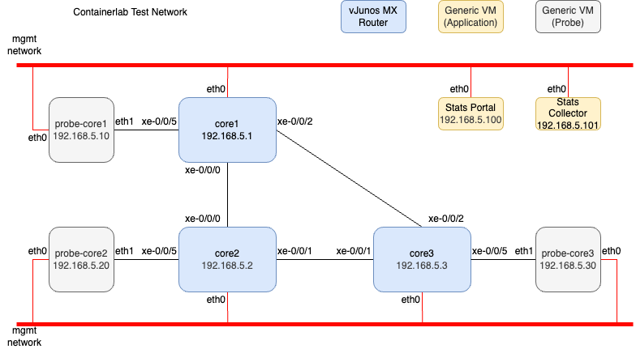
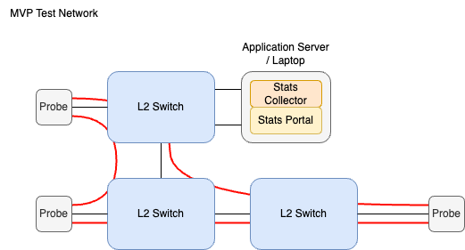
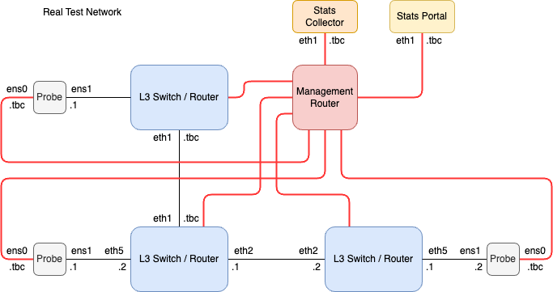

# Aquila
A (hopefully scalable) network monitoring tool used to determine packet loss and latency between nodes on a network using:
* A stat building agents, running on probes connected to the interfaces of access/edge switches
* A SQL-based stat collection service to handle the flow data from the probes
* A PHP-based web application to:
    * Display the network flow stats in a presentable (and useful!) way
    * Manage (onbboard, maintain and decomission) probes running on the network

### Containerlab Testing Environment

Unarguably the cleanest looking diagram of the project, the clab testing environment aims to have every possibe physical device needed for final implementation, all running on one (powerful-ish) hypervisor that will (aim to) be ready as soon as you run the command `sudo containerlab deploy` from the `Aquila/Containerlab/` directory.

I aim to make playbooks / scripts to auto-deploy config and application data to the containers once provisioned and actually working.

### Physical Proof of Concept Testing environment

The probes would run a custom program to send tcp-based icmp packets across a given network to every other probe's LAN interface, if a packet is sent to a destination but not recieved, the deviation is recorded and sent to a logging service and sent to the network matrix so an engineer is aware of the change in network state.

The packet flow of the probes would act as normal traffic on the network to simulate live traffic, so we've got an accurate way of depicting live traffic (Red) losses on the network (Black).

### Realistic Testing environment

To further test the application we can move to a more robust and expected enterprise-level network using layer3 switches to act as a peering exchange taking in client/member traffic (which the probes would replicate) from access switches making use of the management network to access the other services like the stats collector and portal.