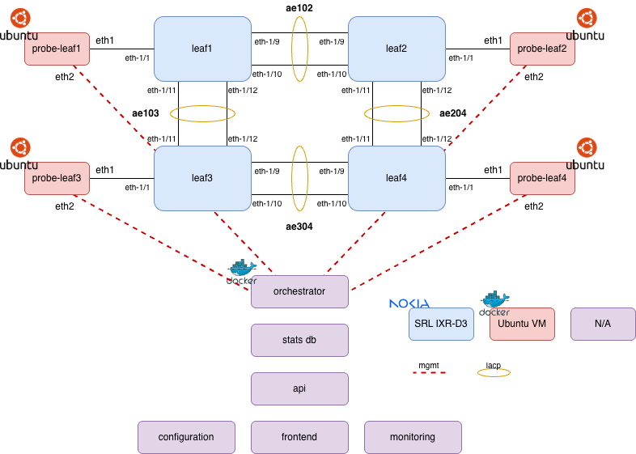

# Aquila
A (hopefully scalable) network monitoring tool used to determine packet loss and latency between nodes on a network using:
* Golang on the Daemon
* Symfony on the webapp
* Junos on the routers (for now)

### High-level diagram:

To test basic functionality we'll use this in the meantime before scaling out to bigger and better things.

| ISL Name    | A End                                 | A End IP       | B End                                 | B End IP       |
|-------------|---------------------------------------|----------------|---------------------------------------|----------------|
| ae102       | leaf1 ethernet-1/9 leaf1 ethernet-1/10 | 172.16.10.0/31 | leaf1 ethernet-1/9 leaf1 ethernet-1/10 | 172.16.10.1/31 |
| ae103       | leaf1 ethernet-1/11 leaf1 ethernet-1/12 | 172.16.10.2/31 | leaf3 ethernet-1/11 leaf3 ethernet-1/12 | 172.16.10.3/31 |
| ae204       | leaf2 ethernet-1/11 leaf2 ethernet-1/12 | 172.16.10.4/31 | leaf4 ethernet-1/11 leaf4 ethernet-1/12 | 172.16.10.5/31 |
| ae304       | leaf3 ethernet-1/9 leaf3 ethernet-1/10 | 172.16.10.6/31 | leaf4 ethernet-1/9 leaf4 ethernet-1/10 | 172.16.10.6/31 |

# Rules:
* Dan's not allowed to write any php

# Tasks:

**Alex**
* Build out network 
    * Configure lacp + ospf ring
    * Document ip addresing schema for isls
* Provision probe interfaces + draft netplan role
* Build / Provision containers for orcestrator / visualisation server
    * Update development dockumentation

**Bas**
* Write / scaffold Go module
* Write PoC scripts to make the probes ping eachother on their LAN interfaces
* Draft go unit tests + actions
* Test clab network

**Vio**
* Configure containerlab (network)
    * Write config templates / config files as network as per diagram
    * Write a provisioning script to apply the configs to the switches

**Dan**
* Configure containerlab (systems)
    Using ansible:
    * Deploy ssh keys for all users + do correct permissions
    * Work with containerlab kind default ubuntu user
    * Provision aquila-user with correct permissions
    * Place demo file in aquila-user dir with correct permissions