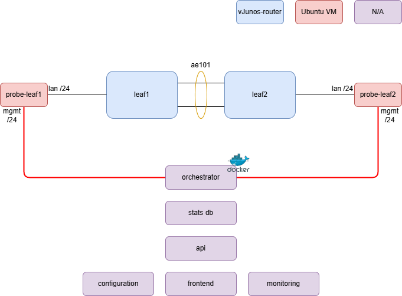

# Aquila
A (hopefully scalable) network monitoring tool used to determine packet loss and latency between nodes on a network using:
* Golang on the Daemon
* Symfony on the webapp
* Junos on the routers (for now)

### High-level diagram:

To test basic functionality we'll use this in the meantime before scaling out to bigger and better things.